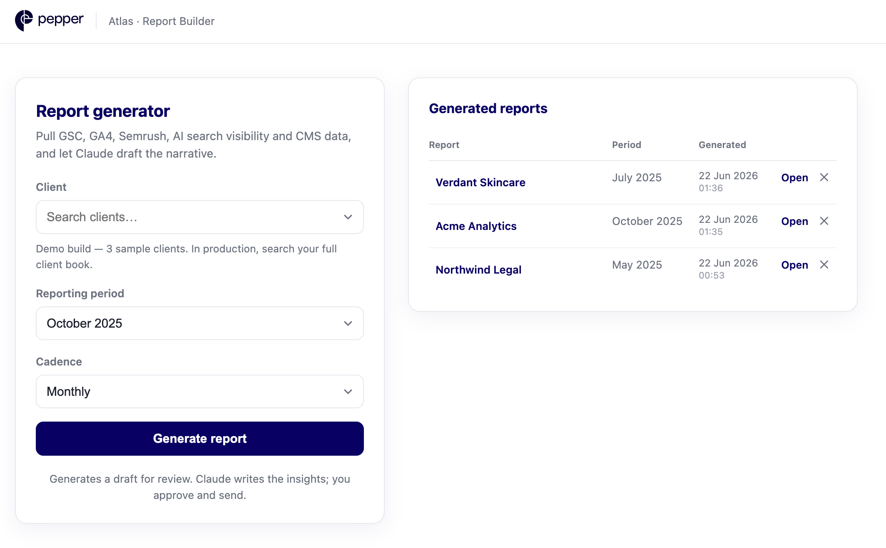
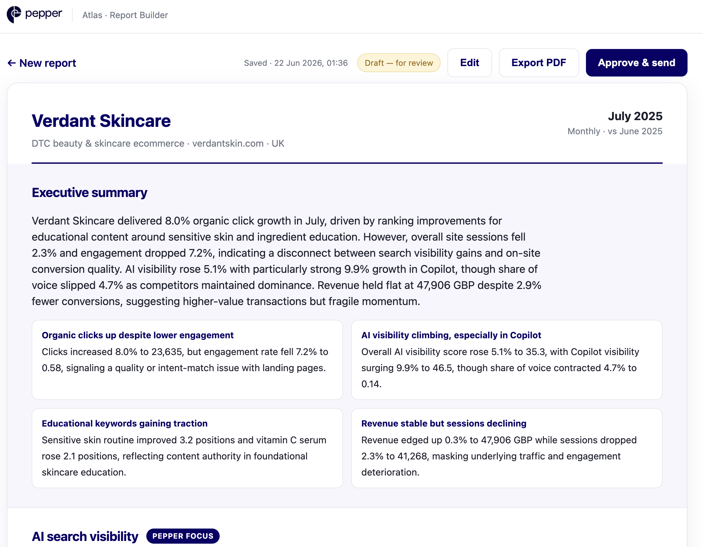
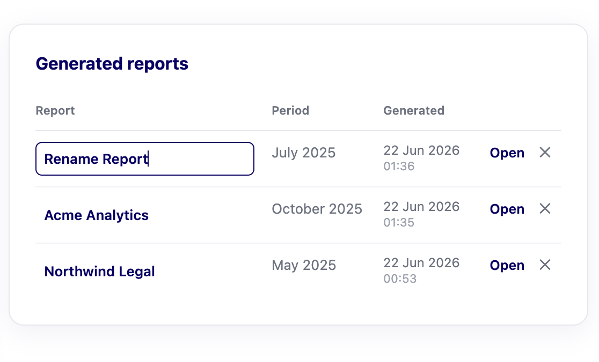
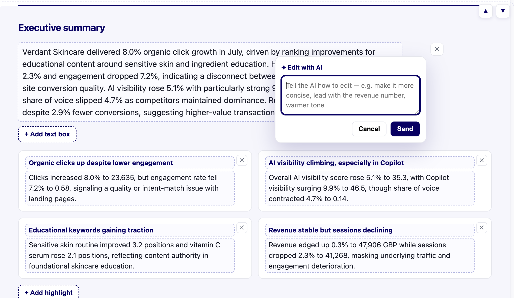

# PRD - Atlas Report Builder

**Owner:** Customer Success / Product

---

## 1. Problem

Every CS manager on Pepper's team spends **4+ hours/week** building recurring
client reports. The work is manual and repetitive: pull data from ~7 sources
(GSC, GA4, Semrush, Semrush AI/GEO, WordPress, Webflow, Contentful), stitch it
into spreadsheets and decks, calculate period-over-period changes, write the
"what happened and why" narrative, format, and email it on a cadence.

The slowest part isn't the charts - it's the **analysis and narrative**: working
out what moved, why, and what to recommend. That's also the part that should
play to an AI-native platform's strengths.

## 2. Goal & success metric

Cut the time to produce a client-ready report from **4+ hours/week to under 30
minutes/week per manager**, with no loss of quality, by automating data
collection, delta computation, narrative drafting, and formatting - leaving the
manager to **review, edit, and approve**.

**North-star metric:** median minutes-to-send per report.
**Guardrail:** edit distance / approval rate (quality must not drop).

## 3. Users & the experience

| Who | When | What they see |
|---|---|---|
| **CS manager** | On the reporting cadence | Picks a client + period + cadence → reviews a fully drafted report → edits it in place (rewrite text, add/remove content blocks, reorder sections) → approves & sends. Reopens, renames, or deletes any past report from the library. |
| **Client** | On receipt | A clean, branded report (HTML/PDF) leading with AI search visibility, then organic, traffic, competitive, and content. |

**Flow:** `Select client + period + cadence` → `Atlas pulls all sources` →
`computes period-over-period deltas` → `Calude AI ( or any other suitable AI )  drafts the narrative &
recommendations` → `manager reviews/edits` → `Approve & send`.

The prototype is the clickable artifact of this flow: a two-pane home (`/`) with
the **report generator** on the left and a **Generated reports** library on the
right, plus the rendered, print-to-PDF report at its own URL (`/reports/<id>`)
with a draft tag, edit button and an Approve & send action. Every generated report is saved
and reopenable from the library.

## 4. What the product does

1. **Connects the sources.** Treated as black-box APIs. The prototype ships a
   mock layer (`atlas/mock_api/`) returning realistic data shapes for 3 demo
   clients; in production each module is swapped for the real client.
2. **Computes period-over-period deltas** for every metric (current vs previous
   period, with direction and whether it's an improvement).
3. **Generates the narrative with Calude AI ( or any other suitable AI ) ** (`Calude AI ( or any other suitable AI ) ): an executive
   summary, per-section insights, highlights, and prioritised recommendations -
   grounded only in the supplied numbers.
4. **Renders a client-ready report**: an HTML page with charts, exportable to
   PDF, leading with **AI search visibility** (Pepper's differentiator).
5. **Review → approve → send** (mocked send in the prototype).
6. **Saves every report** to a local store and lists it in a **Generated
   reports** library - reopen, rename, or delete without recomputing or
   re-calling Calude AI ( or any other suitable AI )  (see §6).
7. **Lets the manager curate the report** in an in-place edit mode - rewrite any
   AI-drafted text, add or remove text boxes / highlights / recommendations,
   reorder whole sections, and use an **Edit with AI** assist to rewrite a text
   box or recommendation from a short instruction, then save (see §7).

## 5. Report contents (sections)

| Section | Sources | Key fields |
|---|---|---|
| **AI search visibility** *(lead)* | Semrush AI / GEO | visibility score, share of voice, mention rate, avg position, per-engine breakdown, sentiment, cited pages, sample prompts |
| Organic search | GSC | clicks, impressions, CTR, position; top queries; biggest movers |
| Traffic & conversions | GA4 | sessions, users, engagement, conversions, revenue by channel |
| Competitive | Semrush | keywords, est. traffic, authority score, backlinks; competitor visibility table |
| Content health | WordPress / Webflow / Contentful | inventory, recently published, stale count, refresh candidates |
| Executive summary & recommendations | Calude AI ( or any other suitable AI )  over all of the above | narrative + prioritised actions |

## 6. Report library & persistence

Generated reports are saved so a manager never loses work and can revisit,
re-send, or compare past periods.

- **Storage:** a lightweight local **JSON store** (no database). One file per
  report under `data/reports/<id>.json` holds the full report *including the
  Calude AI narrative*, plus a small `_index.json` for the list. Reopening a saved
  report therefore needs **no recompute and no second Calude AI call** - it's
  instant and free.
- **Library UI:** the home page's right pane is a scrollable **Generated
  reports** table - report name, reporting period, and generated date/time, newest
  first.
- **Per-report actions:**
  - **Open** - reopens the saved report at its own shareable, refresh-safe URL
    (`/reports/<id>`).
  - **Rename** - the report name is editable inline (defaults to the client's
    company name; saved on blur).
  - **Delete** - removes the report from the store (with confirm).
- **Why it matters:** persistence turns one-off generation into a durable record,
  provides the per-report timestamps, and
  is the foundation for production features like scheduled auto-drafts and
  period-over-period comparison.

## 7. Editing & curation (review mode)

The draft is a starting point, not the final word. A report opens in read mode
with an **Edit** button (top-right). Entering edit mode pins the action bar
(sticky) so **Save** is always reachable, and turns the Calude AI ( or any other suitable AI ) -written narrative
into directly editable, add/remove-able content. Saving persists every change to
the report's stored JSON; reopening shows the curated version (no re-generation).

- **Editable text.** Every piece of Calude AI ( or any other suitable AI )  prose is editable in place - the
  executive summary, each section overview, highlight cards, and recommendations.
- **Add / remove content.** Managers aren't locked to what Calude AI ( or any other suitable AI )  produced:
  - **Text boxes** - add or remove paragraphs in the executive summary and any
    section overview.
  - **Highlights** - add or remove the summary highlight cards.
  - **Recommendations** - add or remove items, and cycle each one's priority
    (High / Medium / Low).
  - Blank entries are dropped on save; invalid priorities normalise to Medium.
- **Reorder sections.** Whole sections (AI search visibility, organic, traffic,
  competitive, content, recommendations, executive summary) can be moved up or
  down. The chosen order is saved per report and re-applied whenever it's opened.
- **Edit with AI.** Hovering any editable text box (executive summary or a
  section overview) or recommendation reveals a **✦ Edit with AI** action. The
  manager types a short instruction (e.g. "make it more concise", "lead with the
  revenue number", "warmer tone") and a dedicated AI edit function rewrites just
  that piece and drops the suggestion straight into the field. The function uses
  its own system prompt (edit-only, stay grounded, no invented numbers, keep the
  client-ready tone) and is sent **the full report context plus the specific text
  being edited**, so the rewrite is aware of both what it's changing and the data
  behind it. It returns a suggestion only — nothing is persisted until the
  manager reviews it and hits Save. (Implemented as a separate Claude Sonnet
  call, distinct from the report-generation prompt.)
- **Safety.** Editing is only available on saved reports; the server accepts only
  known narrative fields and section ids (unknown paths are ignored); and the UI
  warns before navigating away with unsaved changes.
- **Why it matters.** It keeps a human in the loop - the manager owns the final
  client-facing output - while preserving the time saved on the first draft. The
  **edit ratio** this produces is also a core quality signal:
  the less managers need to change, the more the draft is trusted, and overtime with confidence the whole process can be made faster and even automated.

## 8. Data sources used (and why)

From the documented endpoints we use what a recurring report actually needs:

- **GSC `searchanalytics.query`** - single source of truth for organic clicks /
  impressions / CTR / position, by query and page.
- **GA4 `properties.runReport`** - sessions, conversions, revenue by channel;
  ties search to business outcomes.
- **Semrush `domain_organic`, `domain_organic_pages`, `backlinks_overview`,
  competitor visibility** - rankings, authority, competitive context.
- **Semrush AI `ai_visibility_overview`, `ai_prompt_mentions`,
  `ai_citation_tracking`** - the AI-visibility story.
- **WordPress / Webflow / Contentful list endpoints** - content inventory and
  `modified` dates for the refresh program.

**Endpoints intentionally skipped:** GSC URL Inspection / sitemaps / mobile test
(diagnostics, not recurring-report material). **What we'd add:** a per-client
**branding/config** record (logo, tone, KPI targets) and a **commentary store**
so manager edits feed back into future drafts (see §9).

## 9. Scope

**In scope (prototype):** the flow above, 3 demo clients, mock data layer,
Calude AI ( or any other suitable AI )  narrative, HTML/PDF report, a local **report library** (save, reopen,
rename, delete), and an **in-place edit mode** (editable text, add/remove
content blocks, reorder sections).

**Non-goals (per brief - assume they exist):** auth, billing, dashboard chrome,
real API integration/credentials, scheduling/automated send, and multi-tenant /
cloud storage (the prototype's JSON store is single-user and local).

**Next:** real source connectors; saved per-client branding & KPI targets;
scheduled auto-draft + notify; period-over-period comparison across saved
reports; manager edits captured as feedback to improve future drafts; alerting on
notable swings.
